# Project description
MATLAB-based statistical analysis project covering empirical distribution verification, KDE and normality testing. Includes a detailed comparative study of 2022 financial stock data (AVGO & STT) using Jarque-Bera and T-tests.

# Tech stack and methodology
1) Environment: **MATLAB**
2) Input data: real-life 2022 datasets of **CSV** format obtained from the U.S stock market as well as pre-prepared datasets meant for training

# Repository contents
1) [code&data](code&data) - contains necessary data and code script for MATLAB => [report_task1.m](code&data/report_task1.m)
2) [docs](docs) - contains full report on tasks done with results evaluation wrapped in a PDF file => [raport1.pdf](docs/raport1.pdf)
3) [images](images) - contains plots generated by matlab shown previously here, in the [README.md](README.md) file

# Visualizations
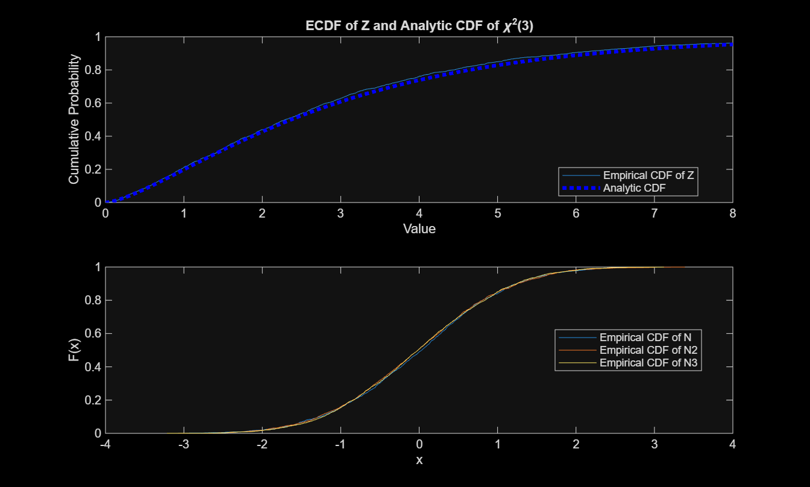
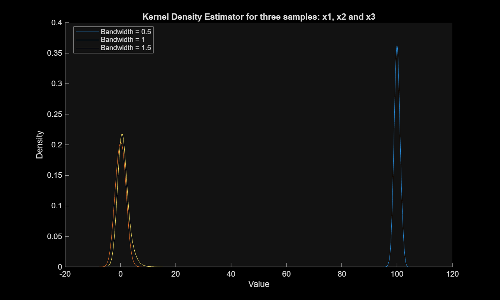
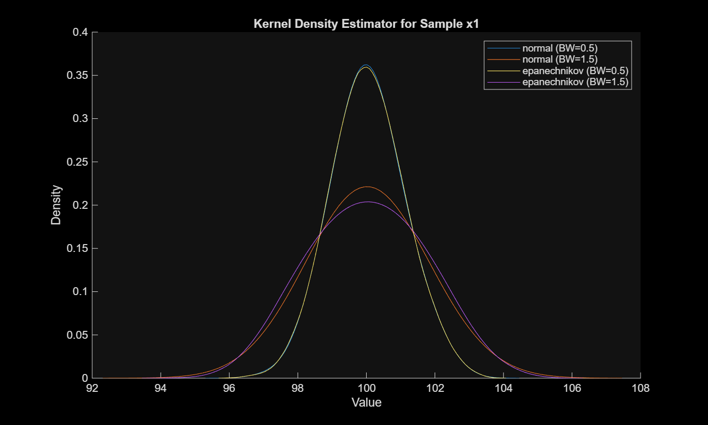
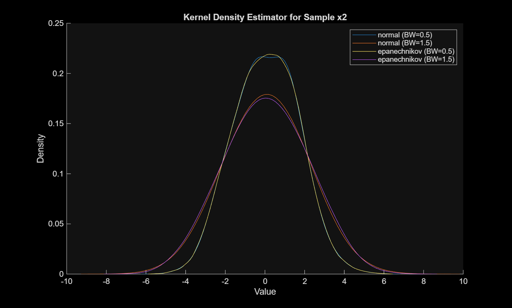
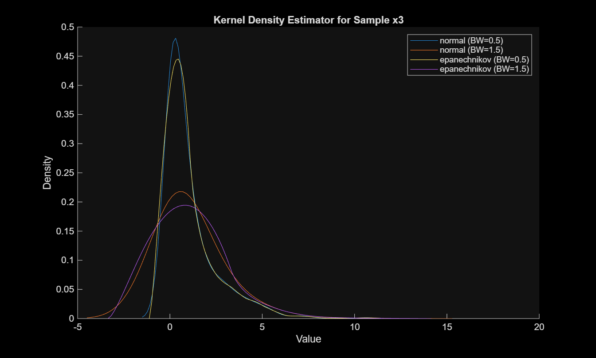
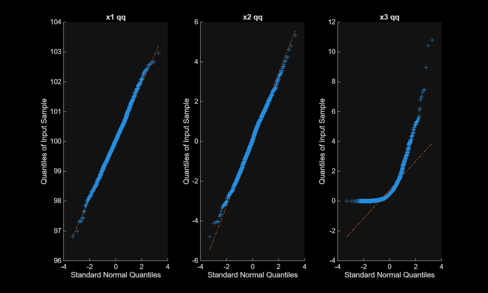
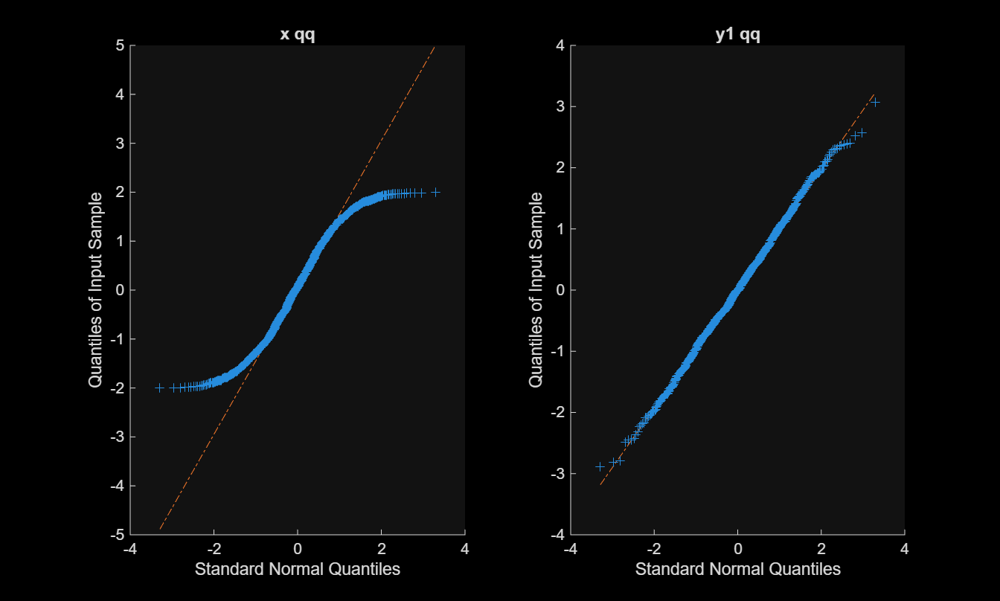
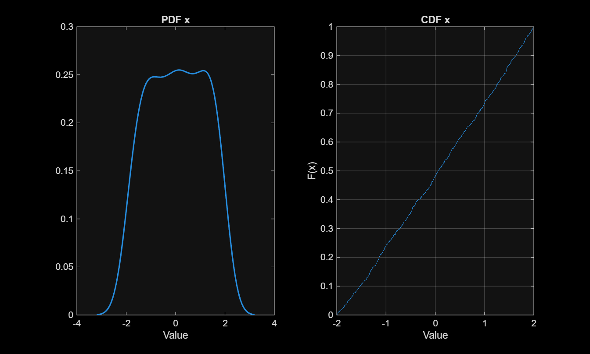

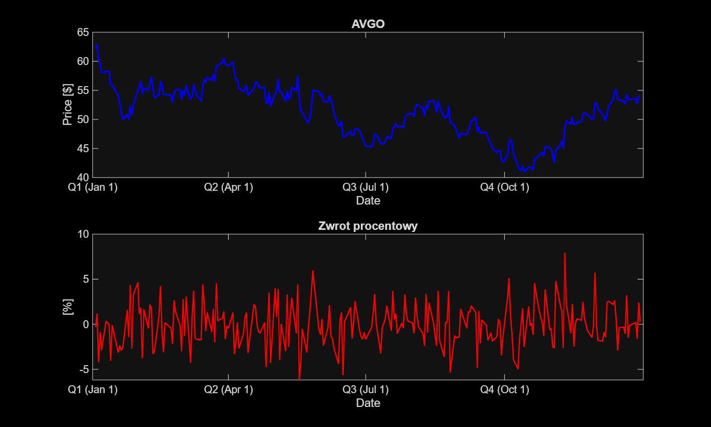
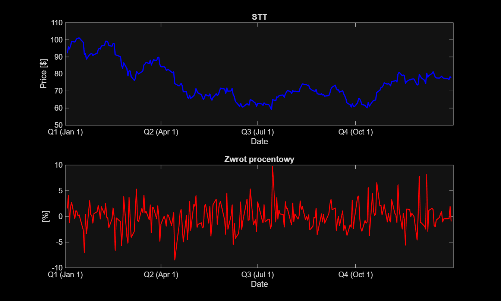
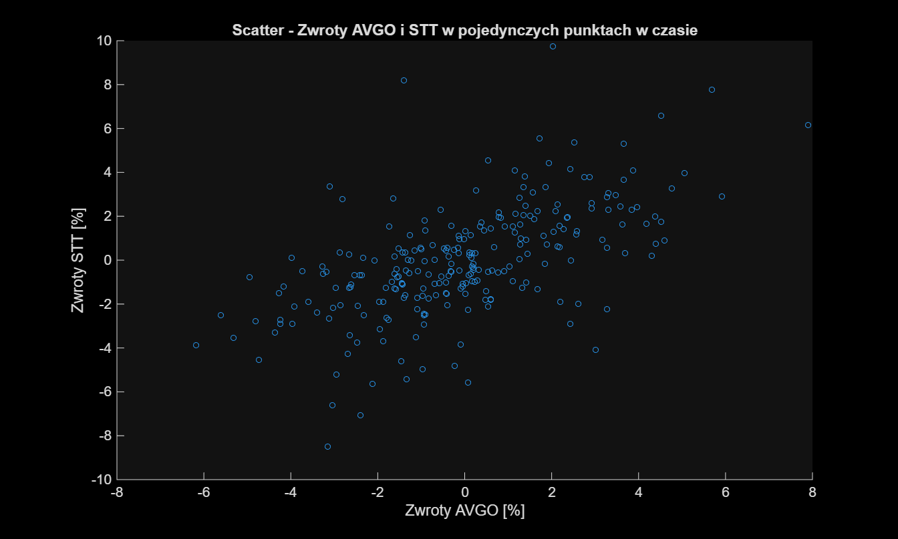
